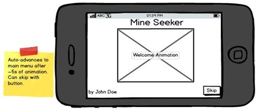
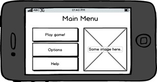
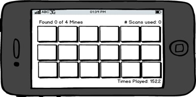
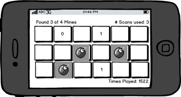
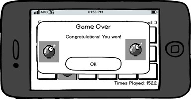
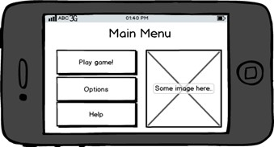
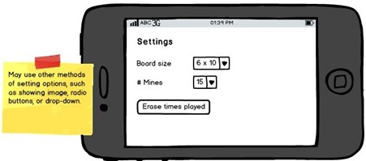
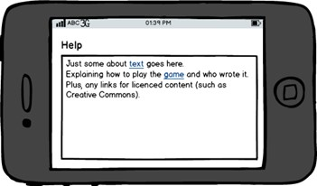

# MineSweeper-Game
Mine Seeker , but with a twist of finding ZOMBIES instead of MINES , is a game where the player tries to find a certain number of mines which are randomly placed in cells on the game board. The player taps on a cell to inspect it. If the cell contains a mine, then the mine is revealed. If there is no mine, then inspecting the cell triggers a scan which shows the count of hidden mines in the same row and column as the selected cell. This information allows the player to make smart choices about which cells to inspect. The goal is to find all the mines using the minimum number of scans.

# UI Mockup
### 1.	User launches game; welcome shown; then advances to main menu.

Figure 2: Welcome splash screen.
### 2.	User taps the button to play a game and changes to the game screen.

Figure 3: Menu allowing access to game, options and help.
### 3.	User shown game screen with grid of buttons. User taps buttons to scan, and to find mines.

Figure 4: Game board before any moves.
    
### 4.	As user finds mines, the scan numbers update.

Figure 5: Game board after some user moves.

### 5.	When user finds all mines, sees congratulations message and return to Main Menu.

Figure 6: Winning congratulations message.

### 6.	From Main Menu, user selects Options screen.

Figure 7: Main menu.
 
### 7.	On Options screen, user can change game settings.

Figure 8: Options screen to change game settings.

### 8.	User returns to Main Menu, and then navigates to help screen.

Figure 9: Help screen with game directions and about information.

# Software Requirements Specification
#### 1.	Welcome screen.
1.1	Program must start up showing the welcome screen.

1.2	Welcome screen must include at least the following elements:
-	Name of application
-	Name of application's author(s)
-	One or more images. Could include a picture or cartoon of the authors, an icon for the application, or related images.

1.3	Welcome screen may include two or more different animations (such as fade, spin, or move). It may have complicated animations such as rotating and moving a block of elements at once.

1.4	Welcome screen must have a button (or similar interface) which allows the user to skip animations (if any) and go to the Main Menu.

1.5	The Welcome screen may automatically advance to the Main Menu after all animations (if any) have finished, plus at least 4 extra seconds.

#### 2.	Main Menu 
2.1	Display a button to navigate to the Game screen.

2.2	Navigating to the Game screen creates a new game with the correct configuration specified on the Options screen.

2.3	Display a button to navigate to the Options screen.

2.4	Display a button to navigate to the Help screen.

2.5	Buttons displayed may be fancy and visually appealing featuring icons.

#### 3.	Game Screen
3.1	Display text stating how many mines total there are on the game board (hidden or revealed)

3.2	Display text stating how many mines the player has revealed.

3.3	Display text stating how many scans it has taken the user so far this game.

3.4	Display a grid of buttons (or UI elements which have button-like functionality). The grid size is set by the options screen.

3.5	The number of mines on the game board is set by the options screen.

3.6	Tapping a cell investigates the cell, which either:
1)	Reveals a mine if one is present.
2)	Performs a scan if either no mine is present, or the mine has already been revealed. Tapping on an already scanned cell has no effect and does not count as an additional scan.

3.7	When a mine is revealed, the button must indicate that it contains a mine. The button must display an icon or image on it showing it is a mine.

3.8	When a scan is performed, the count of hidden mines in the row and column is displayed in that button.

3.9	When a mine is revealed, any of the buttons in its row and column which show a count of hidden mines must be updated with the new count of hidden mines (count decreases by 1).

3.10 The scanning may be animated to show a scan happening (like a ship's radar searching), or a pulse wave going out across the row and column.

3.11 App may play a sound when it scans and when the user finds a mine.

3.12 App may vibrate when it scans and when the user finds a mine. Different vibration feel for each would be best.

3.13 May display text stating the total number of games started (saved between application launches).

3.14 May display text stating the best score so far of any completed game of this specific configuration (board size and number of mines); must save best score for each possible configuration.

#### 4. Player Win Congratulate Pop Up
4.1	When the player finds the last mine, redraw the game board showing the mine and updated hidden-mine counts.

4.2	When the player finds all mines on the board, display a congratulations dialog.

4.3	The congratulations dialog must have at least one image, and some text congratulating the player.

4.4	When the player dismisses the dialog (taps OK, or the like), return to the Main Menu.

4.5	From the Main Menu, pressing the Android back button must then quit the application.

#### 5.	Options screen 
5.1	User can select the board size, from options including at least:
-	4 rows by 6 columns
-	5 rows by 10 columns
-	6 rows by 15 columns

5.2	User can select number of mines, from options including at least:
-	6 mines
-	10 mines
-	15 mines
-	20 mines

5.3	The game size, and number of mines are saved between application runs.

5.4	May allow user to reset number of times game has been played, and best scores for each game configuration (if supported).

#### 6.	Help Screen 
6.1	The about-the-author text must include a hyperlink to the CMPT 276 home-page.

6.2	The game information text must explain some of the basics about the game. You must use your own wording, not copying the text from the assignment document. Your text should reflect the theme of your game.

6.3	The Help screen must provide the correct citation for any images, icons, or other resources (such as music) used in the game (for copyright purposes). Include a hyperlink if applicable.

6.4	Pressing the Android back button on the Help screen returns to the Main Menu.

 

